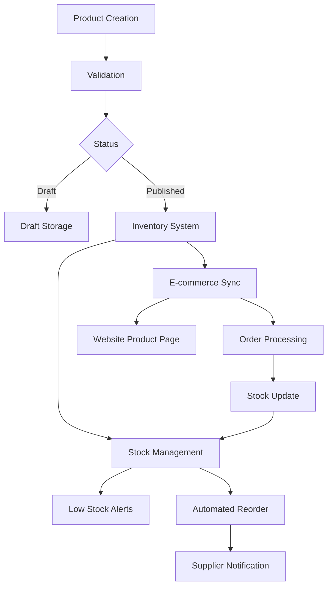
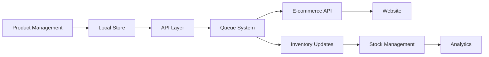
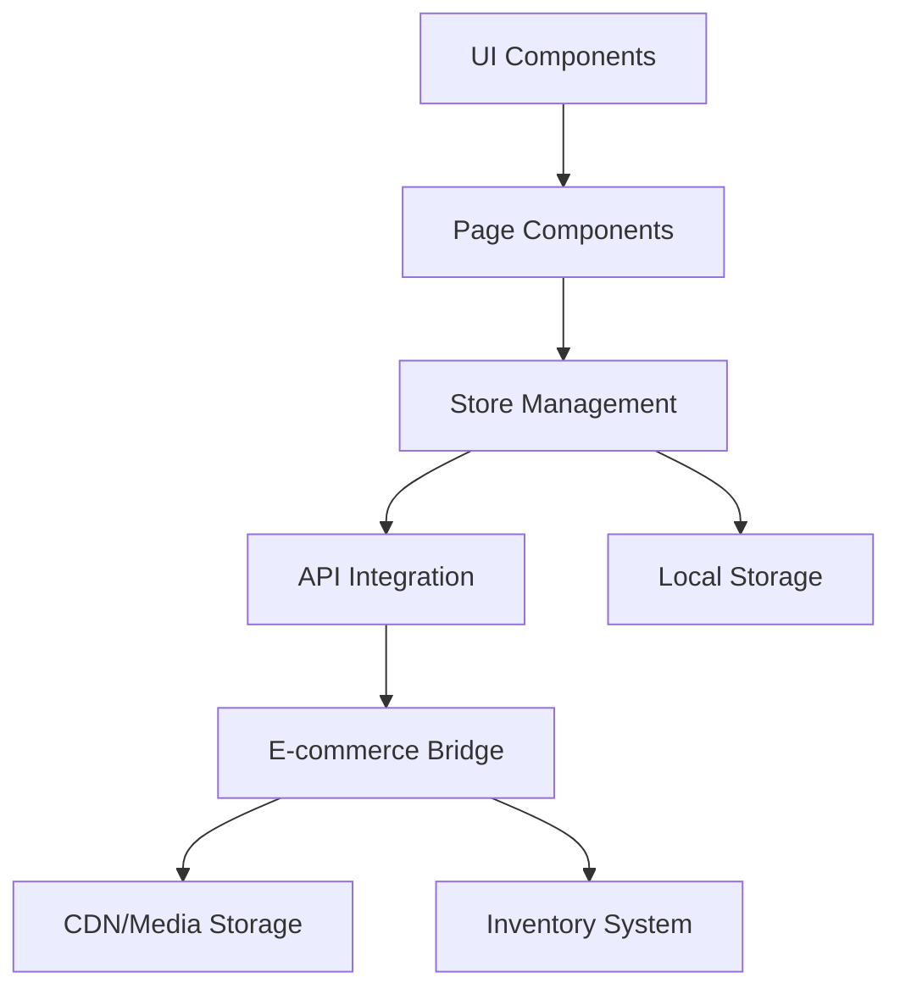

# System Architecture

## Product Lifecycle Flow

```mermaid
graph TD
    A[Product Creation] --> B[Validation]
    B --> C{Status}
    C -->|Draft| D[Draft Storage]
    C -->|Published| E[Inventory System]
    E --> F[Stock Management]
    F --> G[Low Stock Alerts]
    E --> H[E-commerce Sync]
    H --> I[Website Product Page]
    F --> J[Automated Reorder]
    J --> K[Supplier Notification]
    H --> L[Order Processing]
    L --> M[Stock Update]
    M --> F
```

## Data Flow Architecture

```mermaid
graph LR
    A[Product Management] --> B[Local Store]
    B --> C[API Layer]
    C --> D[Queue System]
    D --> E[E-commerce API]
    E --> F[Website]
    D --> G[Inventory Updates]
    G --> H[Stock Management]
    H --> I[Analytics]
```

## Component Architecture

```mermaid
graph TD
    A[UI Components] --> B[Page Components]
    B --> C[Store Management]
    C --> D[API Integration]
    D --> E[E-commerce Bridge]
    C --> F[Local Storage]
    E --> G[CDN/Media Storage]
    E --> H[Inventory System]
```
