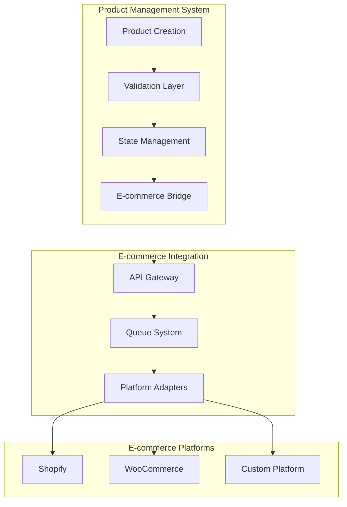

# System Architecture

## Overview

## Core Components

### 1. Product Management Layer
- Product creation and validation
- Category management
- Image processing
- Inventory tracking

### 2. State Management
- Zustand store
- Real-time updates
- Cache management
- Optimistic updates

### 3. E-commerce Bridge

[Detailed component descriptions continue...]

## Product Lifecycle Flow

## Data Flow Architecture

## Component Architecture

