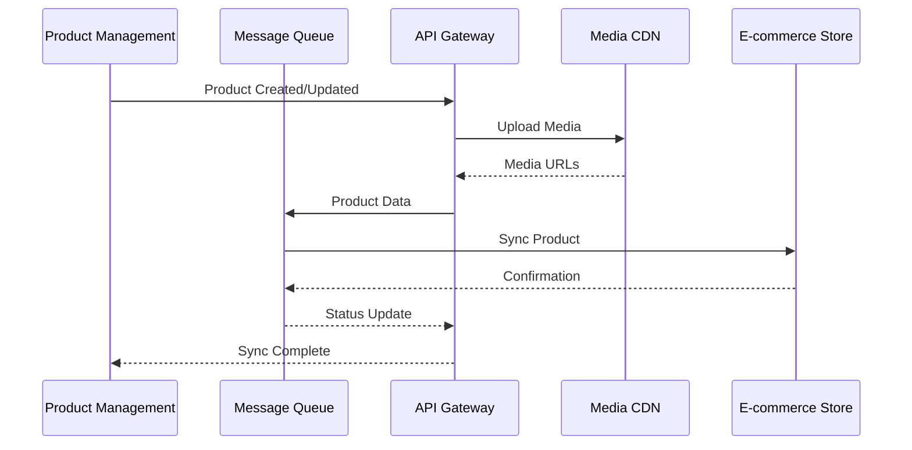
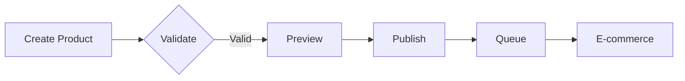

# E-commerce Integration

## Integration Flow

## Synchronization Strategy
1. Real-time product updates
2. Automated stock synchronization
3. Order status webhooks
4. Image optimization and CDN delivery
5. Price and promotion management

## Publishing Workflow

1. **Product Creation**

## Platform Requirements

### API Endpoints
- POST /api/products - Create/Update product
- GET /api/sync/status - Check sync status
- POST /api/webhooks/inventory - Stock updates
- POST /api/webhooks/orders - Order updates

### Image Processing
- Maximum size: 5MB per image
- Formats: JPG, PNG, WebP
- Auto-optimization for web
- CDN distribution

### Data Requirements
- Unique SKU/Product ID
- Complete product metadata
- Category mapping
- Price and stock information
- SEO metadata

## Integration Setup

1. **Configure E-commerce Platform**
   - Generate API keys
   - Set up webhooks
   - Configure CORS settings
   - Test API connection

2. **Configure Product Sync**
   - Map product categories
   - Set up image processing
   - Configure sync schedules
   - Set up error notifications

3. **Monitor & Maintain**
   - Track sync status
   - Monitor API performance
   - Handle sync failures
   - Update mappings as needed

## Security Considerations
- API key rotation
- Rate limiting
- Data validation
- Error logging
- Access control
