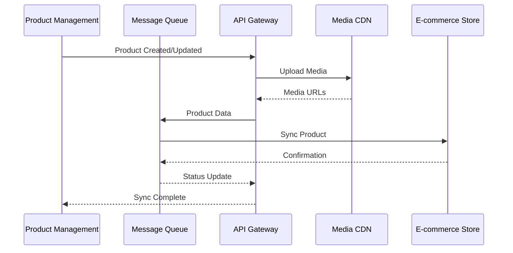

# E-commerce Integration

## Integration Flow

## Synchronization Strategy
1. Real-time product updates
2. Automated stock synchronization
3. Order status webhooks
4. Image optimization and CDN delivery
5. Price and promotion management

[Additional integration details...]
